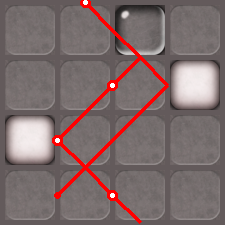

# Lazor Game Solver - Software Carpentry Group Project

A Python-based solution for the "Lazor" puzzle game, developed as part of a Software Carpentry project. The solver automates the process of solving Lazor levels by calculating optimal block placements to guide lasers to target points. The solution is visualized in both text and image formats.

## 📋 Table of Contents
- [Authors](#authors)
- [Project Description](#project-description)
- [Features](#features)
- [File Structure](#file-structure)
- [Setup & Usage](#setup--usage)
- [Requirements](#requirements)
- [Example Usage](#example-usage)
- [Additional Notes](#additional-notes)

## 👥 Authors
- **Peiqi Shi**
- **Boshen Pan**

## 📖 Project Description
This Lazor game solver reads a `.bff` file containing the game board layout, laser positions, directions, block types, and target points. The code calculates valid block placements to guide lasers to hit all targets. The solution is output as both a `.png` image with color-coded blocks and a `.txt` file listing the exact block placements.

## 🚀 Features
- **Block Types**:
  - **A**: Reflect block - redirects lasers at 90°.
  - **B**: Opaque block - blocks lasers completely.
  - **C**: Refract block - allows lasers to pass while creating a new path.
  - **Fixed blocks**: Some blocks are fixed on the board and cannot be moved.
  
- **Automated Visualization**:
  - Solution files include a `.png` image (color-coded for each block type) and a `.txt` file listing block placements:
    - **Reflect block (A):** white
    - **Opaque block (B):** black
    - **Refract block (C):** gray

- **Efficient Performance**: Typically solves standard boards within seconds, although larger boards may take slightly longer.

## 📁 File Structure
To ensure proper functionality, download the following files and place them in the **same directory**:

- **Main Code**: `lazor.py` - Main script for reading the `.bff` file, calculating solutions, and generating outputs.
- **Block Images**: `A.jpg`, `B.jpg`, `C.jpg`, `o.jpg` - Images for each block type used in the solution visualization.
- **Configuration Files**: `.bff` files defining different game levels (e.g., `mad_1.bff`, `dark_1.bff`, etc.).
- **Output Files** (Generated by running the code):
  - `.txt` files - Solution text files with block placements (e.g., `mad_1.txt`, `dark_1.txt`).
  - `.png` files - Solution images showing color-coded block placements (e.g., `mad_1.png`, `dark_1.png`).

## ⚙️ Setup & Usage

1. **Download Files**:
   - Clone or download this repository and place `lazor.py`, the `.bff` files, and the block images (`A.jpg`, `B.jpg`, `C.jpg`, `o.jpg`) in the **same folder**.

2. **Set the Filename**:
   - Open `lazor.py`, locate the filename setting at the end of the script, and set it to the `.bff` file you wish to solve (e.g., `mad_1.bff`).

3. **Run the Code**:
   - Execute `lazor.py` in a Python environment. This will:
     - Parse the `.bff` file,
     - Calculate the solution,
     - Generate output files showing the correct block placements.

4. **View the Results**:
   - The output will include:
     - A `.txt` file (e.g., `mad_1.txt`) listing the block placements.
     - A `.png` image (e.g., `mad_1.png`) displaying the board with color-coded blocks.

## 📦 Requirements
- **Python 3.x**
- **Pillow** for image processing: `pip install pillow`
- **Matplotlib** for displaying the solution image: `pip install matplotlib`

## 💡 Example Usage
To solve a puzzle using `mad_1.bff`, set the `filename` in `lazor.py` as `"mad_1.bff"` and run the script. The solution will be output in both text and image formats, indicating the correct block placements to solve the level.

## 📝 Additional Notes
This project uses custom logic to parse `.bff` files, configure laser paths, and calculate optimal block placements. Each level is unique, and the solution time may vary based on board complexity.

## 📷 Example Output
  

This example shows the color-coded solution for a Lazor puzzle.

## 📄 License
This project is for educational purposes. Please contact the authors for permission if you wish to use this project beyond its intended scope.
